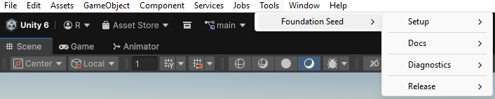
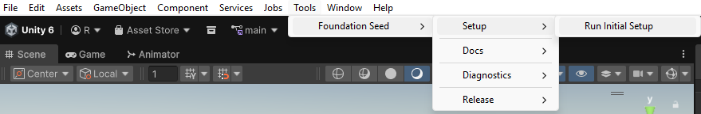
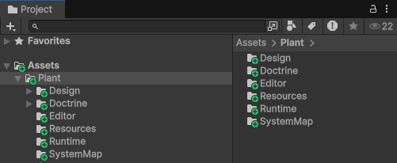

# Foundation Seed

A structured Unity foundation designed for AI-assisted development workflows.

Designed to give AI tools a predictable, structured environment to operate in to reduce drift and keeping projects stable as they evolve.

This project is built around two layers:

- **Foundation**: the stable core that defines how everything runs  
- **Plant**: the part you grow. Your gameplay, systems, and features  

The seed (foundation) provides the structure.  
The plant (your project) grows on top of it.

---

## What This Is

A **structured starting foundation for Unity projects**, designed for modern workflows where AI tools (like Codex) help build and modify systems.

Instead of starting from a blank project or a loose collection of scripts, this gives you a **stable, organized base** that your project grows from.

---

## Who This Is For

- Developers building Unity projects with AI tools
- Anyone tired of projects becoming messy over time
- People who care about structure, not just speed

---

## Quick Start

Get a new project running in a few minutes.

### 1. Install

Copy the package into your Unity project:

`Packages/com.ryans.foundation.seed`

Open Unity and wait for it to compile.

---

### 2. Run Setup

In Unity, go to:

`Tools → Foundation Seed → Setup → Run Initial Setup`

This creates your project structure and required config.

---

### 3. Initialize

Press **Play** once.

This initializes the runtime bootstrap.

---

### 4. Validate

Run:

`Tools → Foundation Seed → Diagnostics → Validate Foundation Setup`

This confirms everything is working correctly.

---

### 5. Add AI Context (Required for Codex)

Copy the setup blurb:

`Tools → Foundation Seed → Docs → Copy AGENTS Foundation Setup Blurb`

Paste it into an `AGENTS.md` file in your **Codex project root folder**.

This is the folder you selected when creating or opening the project in Codex.

In a typical Unity project, this means `AGENTS.md` sits alongside folders like:

- `Assets/`
- `Packages/`
- `ProjectSettings/`
- `Library/`
- `Logs/`

Do NOT place it inside `Assets/`.

---

### 6. Start Building

Your project code goes here:

`Assets/Plant/`

- `Runtime/` → gameplay and systems  
- `Editor/` → tools  
- `Doctrine/` → rules and structure  
- `SystemMap/` → project mapping  
- `Design/` → deeper systems and workflows  

---

### Done

You now have:

- a working runtime foundation  
- logging and validation active  
- a structured project layout  
- a stable base for AI-assisted development  

---

### Important

Do **not** modify the foundation package itself.

All project-specific code should live under:

`Assets/Plant/`

---

## Why This Exists

When building projects, especially with AI, things can quickly become:

- hard to track  
- inconsistent  
- difficult to debug  

This foundation exists to prevent that.

It provides:

- a **clear structure from the start**
- a **reliable runtime backbone**
- built-in **logging and validation**
- a way to **track what changed and why**

> The goal: keep your project stable and understandable, even as it evolves quickly.

---

## The Core Idea

Think of your project as two layers:

### Foundation
The stable base (this package)

- provides core systems  
- enforces structure  
- stays consistent  

### Project ("Plant")
Everything you build on top

- gameplay systems  
- features  
- project-specific logic  

---

This separation prevents your project from becoming messy over time.

---

## What This Is NOT

This is **not** a gameplay template.

It does NOT include:

- characters  
- mechanics  
- scenes  
- genre-specific systems  

---

## What This Actually Gives You

- A **clean starting point**
- A **controlled environment for building systems**
- Built-in tools for:
  - logging
  - validation
  - runtime inspection
- A structure that both **humans and AI can work inside safely**

---

## Observability

Foundation Seed logs gameplay sessions as structured data.

That means AI is not just writing code blindly. It can read what actually happened during a play session and use that as context.

In practice, this lets AI act more like a debugger or balancing tool. Instead of guessing from scripts, it can see runtime behavior and make decisions based on real data.

This creates a much tighter loop between building, running, and improving systems.

---

## Doctrine

Doctrine defines the rules and constraints that govern how AI operates within the project.

It is not documentation.

It is the system-level guidance that shapes how code is generated, structured, and evolved.

---

## How to Think About It

- This is your project’s **engine room**, not the game itself  
- It handles **how things run**  
- You focus on **what the game is**

---

## One-Line Summary

> A structured Unity foundation that keeps projects stable, understandable, and controllable. Especially when building with AI.
